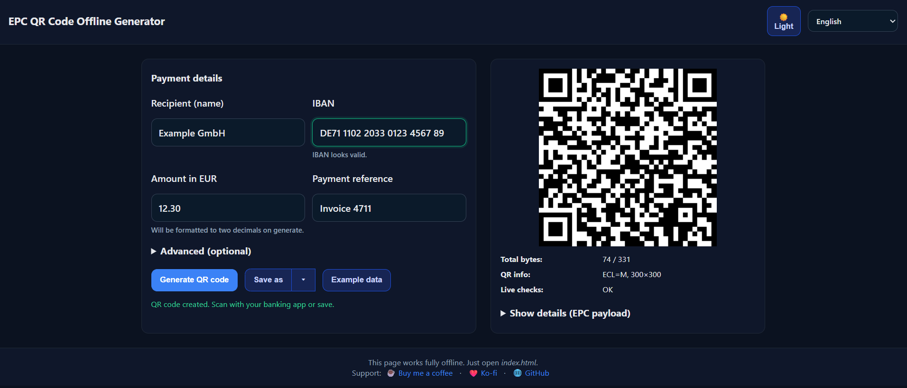

# EPC QR Code Offline Generator

A lightweight, fully offline EPC/SEPA QR code generator. Open `index.html` in a modern browser, fill in the payment details, and save the QR code as PNG, SVG or JPG. No server calls; everything runs locally in your browser.

## Screenshots
Advanced section collapsed:

Advanced section expanded:

## Features
- Offline only: no network requests; all scripts are local
- IBAN validation: live check and readable spacing
- Fields: Recipient, IBAN, Amount (EUR), Payment reference OR Structured reference (RF, ISO 11649), Purpose code, BIC (rarely needed), Note to originator
- EPC payload guard: live byte counter and limit check (max 331 bytes)
- Export: save QR as PNG, SVG, or JPG
- UX niceties: dark/light theme, tooltips, example data, EPC payload details
- Multi‑language: English base plus optional locales in `assets/i18n/`

## Quick Start
1. Clone or download the repository.
2. Open `index.html` in your browser (double‑click is fine). Optionally serve it via a static file server.
3. Fill in the required fields (Recipient, IBAN, optionally Amount) and click “Generate QR code”.
4. Use “Save as” to export the QR code as PNG/SVG/JPG.

Note: The app works entirely offline. You can keep and use it without internet connectivity.

## Fields & Rules (Overview)
- Recipient: free text (required)
- IBAN: validated using Mod97; input with or without spaces
- Amount: decimal EUR value; formatted to two decimals on generate
- Payment reference vs. Structured reference: mutually exclusive (use one or the other)
- Purpose code: 1–4 alphanumeric characters (e.g., GDDS, SALA, CHAR)
- BIC: only needed for special/edge cases outside standard SEPA usage
- EPC payload: maximum length 331 bytes; live counter is shown

## Export
- PNG and JPG: 300×300 px (ECL=M)
- SVG: true vector output, suitable for print

## Internationalization (i18n)
- Base strings: `assets/i18n-core.js` (English)
- Optional languages: individual files under `assets/i18n/<lang>.js`
- When switching the language, the app dynamically loads the file if present
- Add a new translation:
  1) Copy `assets/i18n/de.js` as a template
  2) Fill `window.I18N.<lang> = { ... }`
  3) Name the file using the ISO language code (e.g., `it.js`)

## Project Structure
- `index.html` – UI, styles, and script loading
- `assets/app.js` – App logic: validation, payload build, QR render, export, i18n handling
- `assets/qrcode.min.js` – QR library (local)
- `assets/i18n-core.js` – Base i18n (EN)
- `assets/i18n/*.js` – Optional translations (DE, FR, IT, …)
- `LICENSE` – MIT license

## Development
- No build step required; static files only
- For local testing, simply open `index.html`
- Or serve via any static server, e.g.:
  - Python: `python -m http.server 8080`
  - Node (npx): `npx serve .`

## Privacy
- No data is transmitted. All inputs stay in the user’s browser.

## Support
If this tool helps you and you want to support it:
- Buy Me a Coffee: https://buymeacoffee.com/quasistatic
- Ko‑fi: https://ko-fi.com/quasistatic
- GitHub: https://github.com/quasistatic-setup/EPC-QR-Code-Offline-Generator

## License
MIT — see `LICENSE`.
